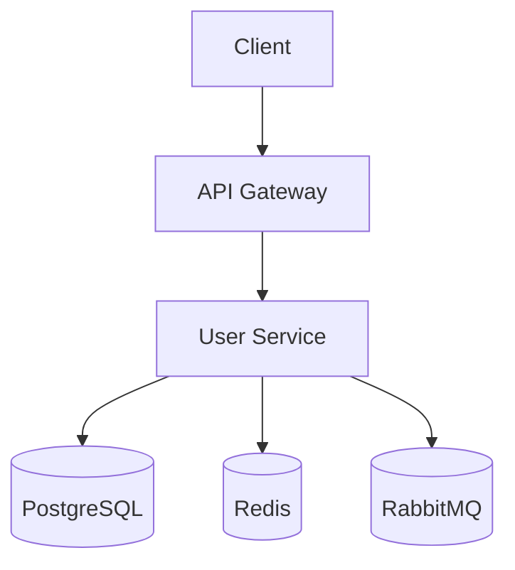
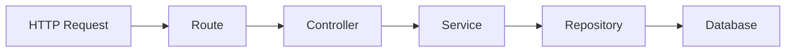
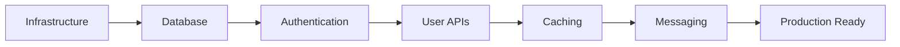
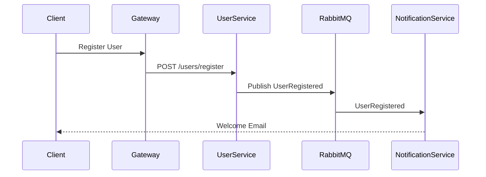

# User Service

The **User Service** is responsible for managing users in the IRCTC Microservices platform. It is the first service in the system and serves as the foundation for authentication, user management, and profile-related operations.

---

# Responsibilities

- User Registration
- User Authentication (Upcoming)
- User Profile Management (Upcoming)
- JWT Token Management (Upcoming)
- Role-Based Access Control (RBAC) (Upcoming)
- Publish User Events (Upcoming)

---

# Tech Stack

| Technology     | Purpose                       |
| -------------- | ----------------------------- |
| Node.js        | Runtime                       |
| TypeScript     | Programming Language          |
| Express.js     | REST API Framework            |
| Docker         | Containerization              |
| Docker Compose | Local Development             |
| PostgreSQL     | Primary Database _(Upcoming)_ |
| Prisma         | ORM _(Upcoming)_              |
| Redis          | Caching _(Upcoming)_          |
| RabbitMQ       | Event Messaging _(Upcoming)_  |
| Zod            | Request Validation            |
| Pino           | Structured Logging            |

---

# Project Structure

```text
user-service/
│
├── src/
│   ├── config/
│   ├── controllers/
│   ├── services/
│   ├── repositories/
│   ├── routes/
│   ├── middlewares/
│   ├── validators/
│   ├── utils/
│   ├── exceptions/
│   ├── clients/
│   ├── app.ts
│   └── index.ts
│
├── prisma/
├── tests/
├── Dockerfile
├── Dockerfile.dev
├── package.json
└── tsconfig.json
```

---

# Architecture



---

# Request Lifecycle

Every request flows through multiple layers.



Each layer has a single responsibility.

---

# Layer Responsibilities

## Routes

- Define API endpoints
- Forward requests to controllers
- No business logic

---

## Controllers

- Receive HTTP requests
- Validate request flow
- Call services
- Return HTTP responses

---

## Services

Contains all business logic.

Examples:

- Register User
- Login User
- Hash Password
- Generate JWT
- Publish Events

---

## Repositories

Responsible only for database access.

Examples:

- Create User
- Find User By Email
- Update User
- Delete User

Repositories never contain business logic.

---

## Middlewares

Cross-cutting concerns shared across requests.

Examples:

- Authentication
- Request Logging
- Error Handling
- Validation
- Request IDs

---

## Validators

Validate incoming requests using Zod.

---

## Config

Application configuration.

Examples:

- Environment Variables
- Database
- Logger
- Constants

---

## Utils

Reusable helper functions.

Examples:

- JWT
- Password Hashing
- Response Helpers

---

## Exceptions

Custom application errors.

Examples:

- ValidationError
- UnauthorizedError
- NotFoundError

---

# Current Endpoints

## Base URL

```
http://localhost:3000/api/v1
```

---

## Health Check

```http
GET /health
```

Response

```json
{
  "status": "UP",
  "service": "user-service",
  "version": "1.0.0",
  "timestamp": "2026-07-01T12:00:00.000Z"
}
```

---

# Development

Install dependencies

```bash
npm install
```

Run locally

```bash
npm run dev
```

Build

```bash
npm run build
```

Start production build

```bash
npm start
```

---

# Docker

Build image

```bash
docker build -t user-service .
```

Run using Docker Compose

```bash
docker compose up --build
```

Run in detached mode

```bash
docker compose up -d
```

Stop containers

```bash
docker compose down
```

---

# Current Status

- ✅ Express Server
- ✅ TypeScript
- ✅ Docker
- ✅ Docker Compose
- ✅ Layered Architecture
- ✅ Health Endpoint
- ✅ Pino Logger
- ✅ Error Handling

---

# Upcoming Features

- PostgreSQL Integration
- Prisma ORM
- User Registration
- User Login
- JWT Authentication
- Refresh Tokens
- RBAC
- Redis Caching
- RabbitMQ Events
- Unit Testing
- Integration Testing

---

# Roadmap



---

# Future Event Flow



---

# Design Principles

- Single Responsibility Principle
- Separation of Concerns
- Layered Architecture
- Database per Service
- Event-Driven Communication
- Stateless Services
- Containerized Deployment
- Independent Scalability
- Production-Ready Code Structure
